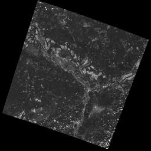
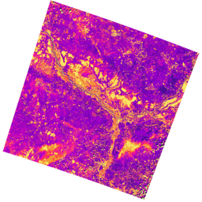

# mapalgebra

*Efficient, polymorphic Map Algebra for Haskell.*

This library is an implementation of *Map Algebra* as described in the
book *GIS and Cartographic Modeling* by Dana Tomlin. The fundamental
primitive is the `Raster`, a rectangular grid of data that usually describes
some area on the earth.

`mapalgebra` is built on top of [massiv](https://github.com/lehins/massiv),
a powerful Parallel Array library by Alexey Kuleshevich.

## Usage

Always compile with `-threaded`, `-O2`, and `-with-rtsopts=-N` for best
performance.

### The `Raster` Type

This library provides `Raster`s which are lazy, polymorphic, and typesafe. They
can hold any kind of data, and are aware of their projection and dimensions
at the type level. This means that imagery of different size or projection
are considered completely different types, which prevents an entire class
of bugs.

`Raster`s have types signatures like this:

```haskell
-- | A Raster of Ints backed by efficient byte-packed arrays, encoded
-- via the `Storable` typeclass. `P` (Prim), `U` (Unbox) and `B` (boxed) are also available.
--
-- This is either a freshly read image, or the result of evaluating a "delayed"
-- (`D` or `DW`) Raster.
Raster S LatLng 256 256 Int

-- | A "delayed" Raster of bytes. Likely the result of some Local Operation.
-- Waiting to be evaluated by the `strict` function.
Raster D WebMercator 512 512 Word8

-- | A "windowed" Raster of an ADT, the result of some Focal Operation.
-- Waiting to be evaluated by the `strict` function.
--
-- A generic `p` means we don't care about Projection here.
Raster DW p 1024 1024 (Maybe Double)
```

### Reading Imagery

`mapalgebra` can currently read any image file of any value type, so long as
it is grayscale (singleband) or RGBA. True multiband rasters (like from LandSat)
are not yet supported.

To read a Raster:

```haskell
-- | You must know the image dimensions ahead of time. If you don't care
-- about the projection, then `p` can be left generic.
getRaster :: IO (Raster S p 512 512 Word8)
getRaster = do
  erast <- fromGray "path/to/image.tif"
  case erast of
    Left err -> ... -- deal with the error.
    Right r  -> pure r
```

### Colouring and Viewing Imagery

To quickly view a Raster you're working on, use the `display` function:

```haskell
-- | Simplified type signature.
display :: Raster D p r c a -> IO ()
```

This will automatically colour gray, evaluate, and display your Raster
using your OS's default image viewer.

To colour a Raster gray yourself, use `grayscale`:

```haskell
grayscale :: Functor (Raster u p r c) => Raster u p r c a -> Raster u p r c (Pixel Y a)
```

True colouring is done with the `classify` function and colour ramps inspired by
Gretchen N. Peterson's book *Cartographer's Toolkit*.

```haskell
-- | Both `Raster D` and `Raster DW` are Functors, so this function works on
-- either of them. `Raster S`, etc., do not form Functors by design.
classify :: (Ord a, Functor f) => b -> Map a b -> f a -> f b

-- | An invisible pixel (alpha channel set to 0) to be passed
-- to `classify` as a default.
invisible :: Pixel RGBA Word8

-- | Given a list of "breaks", forms a colour ramp to be passed
-- to `classify`.
spectrum :: Ord k => [k] -> Map k (Pixel RGBA Word8)
```

We can generate the breaks via `histogram` and `breaks`:

```haskell
-- | Input here is `Raster S`, meaning this image was freshly read,
-- or has already been fully computed with `strict`.
colourIt :: Raster S p r c Word8 -> Raster S p r c (Pixel RGBA Word8)
colourIt r = strict S . classify invisible cm $ lazy r
  where cm = spectrum . breaks $ histogram r
```

Before-and-after:




### Local Operations

All Local Operations defined in *GIS and Cartographic Modeling* are available.
For the usual math ops, `Raster D` has a `Num` instance:

```haskell
rast :: Raster D p 512 512 Int

squared :: Raster D p 512 512 Int
squared = rast * rast  -- Element-wise multiplication.
```

### Focal Operations

Except for *Focal Ranking* and *Focal Insularity*, all Focal Operations of immedatiate
neighbourhoods are provided:

```haskell
rast :: Raster S p 512 512 Double

-- | `Raster DW` forms a Functor, so we can do simple unary transformations
-- (like colouring!) to it after Focal Ops.
averagedPlusAbit :: Raster S p 512 512 Double
averagedPlusAbit = strict S . fmap (+1) $ fmean rast
```

### Typesafe NoData Handling

If it's known that your images have large areas of NoData, consider that `Maybe`
has a `Monoid` instance:

```haskell
import Data.Monoid (Sum(..))

nodatafsum :: Raster S p r c Word8 -> Raster DW p r c 512 Word8
nodatafsum = fmap (maybe 0 getSum) . fmonoid . strict B . fmap check . lazy
  where check 0 = Nothing
        check n = Just $ Sum n
```

In theory, one could construct special `newtype` wrappers with `Monoid` instances
that handle any Focal scenario imaginable.

## Future Work

- Projection handling at IO time
- Reprojections
- Extended neighbourhoods for Focal Ops
- Upsampling and Downsampling
- Improved NoData handling
